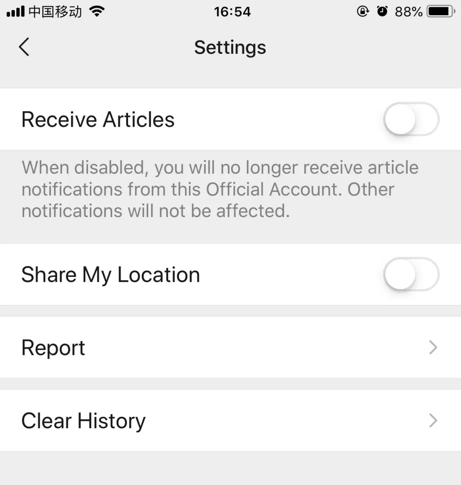

写*《设计冲刺》(Sprint: Solve Big Problems and Test New Ideas in Just Five Days)* 的两位小哥出新书啦。

新书 *Make Time* 在回家这几天迅速看完了，还是一如既往的风格：工具实用，画风可爱。

***时间术*** 这个看起来不明觉厉的词其实来自日文版的翻译，内容倒是没有很高深，都是两位作者平时的**自我管理习惯**。恰好我对时间管理、专注力、效能等话题感兴趣，所以借这本书来聊一聊关于时间和精力的那点事儿。

## Make Time 4-Step Framework

作者的行为模式总结下来分为4步走：***Highlight->Laser->Energize->Reflect***。

我们平时工作和生活中，计划的方式无非是待办清单(Todo List)和目标管理(Goal Setting)：

待办清单一般都是很具体详细的任务，做久了未免觉得人像个机器；

（图来自电影《小王子》）

而目标管理往往都是长期的，很考验一个人的目标拆分和进度管理能力。有时候目标设定好了，列出了一大堆计划后，总给人一种<mark>已经完成目标的错觉</mark>，而后就一直拖延怠工，导致很多目标不了了之。

记得我刚工作的时候，和小组一起讨论过如何提高工作效率。那时候我还在用 ***番茄工作法(Pomodoro)*** ，每天能完成好几件事。而一位比我早入职的同事说，工作中分心的事情太多，每天只能做1-2件事。当时我不以为然，现在渐渐体会到了相同的感觉。作者在书里也提倡类似的理念，每天计划好一块时间(60-90分钟)做最重要的1-2件事，称之为每天的 ***Highlight*** 。我们小组每天早晨开Standup Meeting的时候也是类似做法，每人基本上说今天要做的最重要的事情。

确定好每天的Highlight以后，可以显式地写下来，告诉自己要预留好足够的时间和精力去完成它，然后进入下一步：***Laser Mode***。

Laser Mode就是<mark>将注意力完全放在当下正在做的事情上</mark>，投入沉浸其中的状态，就像激光的光柱一样集中，这和我们所知的 ***Flow(心流)*** 概念非常接近。

想要达到Laser Mode或者心流状态，最难的是如何避免分心。现在智能手机和社交网络的发展真的带来太多distractions，我自己也经常感到注意力不集中，有时一边和人聊天一边看手机，经常前言不搭后语，很不喜欢这种状态。

在作者提到的许多避免分心的习惯中，我最喜欢的是**A Distraction-Free Phone**。我自己的经验是：

1) 把手机上几乎所有的通知都关掉

2) 微信锁屏下不提醒，只留右上角的Badge

3) 不重要的微信群mute，公众号推送mute(公众号右上角设置里)

4) 朋友圈小圆点关掉(设置->隐私里)，不看一些好友的朋友圈(没有恶意，纯粹是为了防止自己刷朋友圈停不下来)

我微信关锁屏通知已经很久了，有的时候再开回来反而一点都不习惯，有时候一些消息真的不需要立马就看到并回复，看消息应该是一个主动的过程，（当然也有可能是在焦虑的状态下无意识去查看。。。）只要知道自己在做更重要的事情，这种做法无可厚非。

看完书后，我又进一步对手机进行“改造”：

5) 首页清空，删除不必要的app，反正装回来很容易，不会再装代表真的不需要它

（满足看验证码，记笔记，查词典，登录账号等要求即可）

目前还没勇气把社交网络的app都删掉，但是可以明确其用途：微博看新闻，Facebook找文章看，Instagram看看好的图片，豆瓣标记一些书影音，知乎当百度知道，邮件app取消了很多订阅。我知道自己对其他社交网络的依赖远没有微信严重，所以也没有做得很彻底。有时候做得太彻底，内心的欲望会反弹。

避免分心是第一步，下一步是如何“**进入状态**”。这里每个人的习惯和方法都不同：有的人喜欢密闭空间，有的人喜欢开放空间；有的人需要安静，有的人需要背景音乐；有的人给自己明确的时间限制，有的人在deadline面前无动于衷……

（图片摄于威海路的WeWork）

我们可以做的是：通过**观察自己**，来发现什么情况下自己容易专注，有的时候需要**做记录**来发现。比如：我自己喜欢在咖啡厅或者其他开放空间里写文章或者做PPT，咖啡厅里放的爵士音乐不让人感到嘈杂，干1-2小时的活往往可以把最重要的部分完成。在家里经常会很懒散，躺着看电视一天就过去了，但是在咖啡厅里必须“伪装”一下认真工作，久而久之也就成了真的状态。

有人说：时间是最宝贵的资源。但是我自己更愿意相信，<mark>精力才是我们应当合理利用的资源</mark>。尤其是那些对我们重要的事情来说，没有效能的时间堆积并不能帮助我们更快更好地完成，而在一个清醒、专注、有能量的状态下，事情远比预想完成得更快更好。

书里也提到了如何 ***Energize*** 的方法，我喜欢的建议是：

1. **轻量锻炼**：走路是最好最容易的锻炼方式，还可以帮助思考。

2. **认真饮食**：一句简单的建议“Eat (real) food. Not too much. Mostly plant. ” ，并且把注意力放在食物上，而不是各种屏幕上。

3. **冥想练习**：练习呼吸、觉知，更有意识，更能注意到自己的情绪。

4. **面对面交流**：和朋友面对面聊天有时候真的能量满满。

5. **适度咖啡因**：选择一天中最合适的时间摄取咖啡因。

6. **摘掉耳机**：我们的脑子里真的不需要太多声音，即使是音乐。

最后，我们需要通过 ***Reflection*** 来反思自己有没有变得更好。用科学家的态度来评估自己对于时间管理的实践效果如何：

1. **观察**自己的行为和反应

2. **推测**背后的原因

3. **试验**自己的改善方法

4. **评估**方法是否有效

比如：我观察到自己在家总是什么都不想干，我推测都是电视的锅，我试着在家里写东西的时候**背对着电视**，就不会边看电视边干活了，最后发现自己在家也可以专注工作，并且维持很长时间的状态。

我非常提倡对自己进行反思总结，不止是在心里，更要主动记下来，积累一段时间后可以更了解自己，也有改进的依据。作者在书里也提供了一个进行反思的日记模板，我打算定制一个专门的日历，来做定期的记录：

（对日历感兴趣的小伙伴，可以考虑一起定制，已经在接洽淘宝卖家了。。。）

 

以上就是对 *Make Time* 这本书一些粗浅的解读，更多内容大家可以去买书领略。

我觉得当作工具书看看还不错，倒不用完全照搬他们的方法。说实话，想看他们的书还有一个原因是：Jake画的插图真的太可爱了！！

（本文中很多插图来自此书的同名网站：[https://maketime.blog/](https://maketime.blog/)）

两位作者一开始是Google的设计师，创造了**设计冲刺**方法论，在写完 *Make Time* 这本书后决定离开Google做专职的作家和航海家，<mark>正是对时间管理的重视让他们意识到什么事情是重要的、是迫不及待想要马上投入精力去做的</mark>。他们对自己观察了很多年之后，完全知道自己的热情和精力在哪里，最后辞职也是自然而然的结果。所以看到最后，还是有一点感动的，真心地以他们为榜样。

还有一个和作者惺惺相惜的原因是，他们在最后推荐的书单里有我看过和想看的书：

> *Deep Work* by Cal Newport  
> 真的是相关话题里被推荐最多的书了，作者的日计划方法我看完后一直在用。

> *The Power of Habit* by Charles Duhigg  
> Habit Loop解释了人的习惯是如何形成的，我觉得对于日常生活很有帮助。

> *Mindset* by Carol Dweck  
> Growth-mindset(成长型思维)也是近几年被推崇的话题吧，我自己安利得太多都不好意思了，但真的是对我影响最大的mindshift。

> *Sapiens* by Yuval Noah Harari  
> 《人类简史》，有很多新颖的观点，大概是最近几年被引用最多的书了。

想看的有：

> *The 4-hour Workweek* by Tim Ferriss  
> 一位前同事推荐的书，光看题目就觉得有吸引力，虽然知道不太现实。

> *Getting Things Done* by David Allen  
> 时间管理的鼻祖，后面衍生了很多GTD工具，如：Todoist, OmniFocus, Trello, Monday……

> *In Defense of Food* by Michael Pollan  
> “Eat (real) food. Not too much. Mostly plant. ”这句话最早是在一门关于饮食的斯坦福MOOC上看到的，非常简单有力，没想到两位作者在书里也援引了。我想再看一下原著，顺便挖个坑，写一下最近一年关于健康饮食和生活方式的心得。

 

Plus：对**时间管理**、**专注力**、**效能**等话题感兴趣的小伙伴，可以和我讨论交流。之前写过的相关文章有：

[回顾\|如何用看板管理文章阅读](https://mp.weixin.qq.com/s?__biz=MzAxODgxOTEzMg==&mid=2655993265&idx=1&sn=20c2a4f4a18384c2764cc96876b088a3&chksm=806bece2b71c65f4a0b35576dc02e85ff99c4d953ce487c1edb69eeb580de51a4bfc36f4e8c0&scene=21#wechat_redirect)

[回顾\|我的2018年都立了哪些Flag?](https://mp.weixin.qq.com/s?__biz=MzAxODgxOTEzMg==&mid=2655993161&idx=1&sn=7cd39761b200da4d84686fae9986540c&chksm=806bec1ab71c650c1a047979d98401ead3c6719323d11cf480c3d6ed65117ae52f5a39dff1b9&scene=21#wechat_redirect)

[书单\|2018年我喜欢的那些书](https://mp.weixin.qq.com/s?__biz=MzAxODgxOTEzMg==&mid=2655993181&idx=1&sn=6104e95654e3068d34ee665cca7dd7b2&chksm=806bec0eb71c6518ad6ad34fd20c33567221c942eae75281f6d29f43c747129c64290458b4bc&scene=21#wechat_redirect)

[回顾\|今年我引导了哪些工作坊?](https://mp.weixin.qq.com/s?__biz=MzAxODgxOTEzMg==&mid=2655993273&idx=1&sn=1dc7229ac451eaa7900e44fe4888005e&chksm=806beceab71c65fcbb257f05f5079ad3836926e6160ccb6212e9e47c736c4b42ec2d97cbea43&scene=21#wechat_redirect)

[乱想\|人只有一条职业道路吗?](https://mp.weixin.qq.com/s?__biz=MzAxODgxOTEzMg==&mid=2655993306&idx=1&sn=439461b8f6df405bee4a209c951d0696&chksm=806bec89b71c659f35e3e31b8acedc28d1969e3170c16e9c9a4d4e2676f33e485b270ed1037c&scene=21#wechat_redirect)